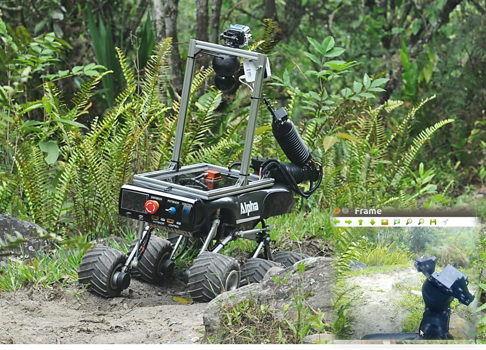

# Alpha ROVER
A repository for a 6-wheel rocker bogie rover, based on Robotic Operative System ROS and Python to control the perception and action systems.

<p align='center'>
    
</p>


* Watch the YouTube video [here](https://www.youtube.com/watch?v=stQqyb9inXY&t=333s)
* Read the document [here](https://repositorio.unibague.edu.co/jspui/bitstream/20.500.12313/1296/1/Trabajo%20de%20grado.pdf)

This repository contents:
- Source codes
- Dev scripts
- Data files

```
/your_root                / path
|--README.md     		  / Instructions to configure the AlphaROVER
|--src         			  / scripts for the system
	  |--APPS
	  |--Arduinio_gps+imu
	  |--Arm            / Based on: https://github.com/FRC4564/Maestro/
	  |--Config
	  |--Control
	  |--EKF
	  |--GPIO
|--data
	|--mechanics  
		|--alpha_full.pdf
		|--inventor_files
		|--photos
	|--electronics
		|--diagrams
		|--proteus_files
|--user_pc
  |--cam_bridge.py
```

## Hardware Requirements:
- NVIDIA Jetson TK1 or NANO
- Ion Motion Roboclaw, Dual DC motor driver
- Pololu USB servo Control [POL-1353]
- Logitech Wireless Gamepad F710
- Hokuyo UTM-30LX-EW Scanning Laser Rangefinder
- Xsens MTi 10-series
- PC host running Ubuntu
- AlphaROVER platform

## Software Requirements:
- OpenCV
- Hamachi


## Jetson NANO
Follow the isntructions from [NVIDIA](https://developer.nvidia.com/embedded/learn/get-started-jetson-nano-devkit#write)
* Download the las SD card [image](https://developer.nvidia.com/jetson-nano-sd-card-image)
* Insert the SD and open the temrinal application
* `dmesg | tail | awk '$3 == "sd" {print}'`
* `/usr/bin/unzip -p ~/Downloads/jetson_nano_devkit_sd_card.zip | sudo /bin/dd of=/dev/sd<x> bs=1M status=progress`
* `sudo eject /dev/sd<x>`
```
$ rosdep apt autoremove thunderbird*
$ sudo apt autoremove libreoffice*
$ sudo apt-get remove --purge libreoffice*
$ sudo apt-get remove libreoffice-core
$ sudo apt-get remove snapd lightdm cups chromium*
$ sudo apt-get remove libcurlpp0
$ sudo apt autoremove transmission-gtk
$ sudo systemctl set-default multi-user.target
$ rosdep update
$ rosdep upgrade
$ sudo apt install htop
$ sudo apt install screen
$ sudo sh -c 'echo "deb http://packages.ros.org/ros/ubuntu $(lsb_release -sc) main" > /etc/apt/sources.list.d/ros-latest.list'
$ sudo apt-key adv --keyserver 'hkp://keyserver.ubuntu.com:80' --recv-key C1CF6E31E6BADE8868B172B4F42ED6FBAB17C654
$ sudo apt update
#sudo apt install ros-melodic-desktop
$ sudo apt install ros-melodic-ros-base
$ apt search ros-melodic
$ sudo apt install python-rosdep python-rosinstall python-rosinstall-generator python-wstool build-essential
$ echo "source /opt/ros/melodic/setup.bash" >> ~/.bashrc
$ source ~/.bashrc
$ sudo rosdep init
$ rosdep update
$ sudo apt-get install nano
```


### Catkin configuration
```
$ sudo apt-get install cmake python-catkin-pkg python-empy python-nose python-setuptools libgtest-dev $ python-rosinstall python-rosinstall-generator python-wstool build-essential git
$ mkdir -p ~/catkin_ws/src
$ cd ~/catkin_ws/
$ catkin_make
$ echo "source ~/catkin_ws/devel/setup.bash" >> ~/.bashrc
$ source ~/.bashrc
```

## Installing other repositories
- Install LiDAR
  `sudo apt install ros-melodic-urg-node`
- Install Joy
  `sudo apt install ros-melodic-joy`
- Install tf
	`sudo apt install ros-melodic-tf`
- Install MS Kinect V1
	`sudo apt-get install libfreenect-dev`
	`sudo apt-get install ros-melodic-freenect-launch`
- Install the MTi USB Serial Driver
  ```
  $ cd $path_alpha_config
  $ git clone https://github.com/xsens/xsens_mt.git
  $ cd ~/xsens_mt
  $ make
  $ sudo modprobe usbserial
  $ sudo insmod ./xsens_mt.ko
  ```
- Install gps_common or gps_umd as available based on the ROS distributable
  `sudo apt-get install ros-melodic-gps-umd` or `sudo apt-get install ros-melodic-gps-common`
- Isntall MTi rosnode
#write the next lines every time before call node.
#sudo modprobe usbserial
#sudo insmod $path_alpha_config$"/xsens_mt/xsens_mt.ko"
    ```
  $ cd ~/catkin_ws/src
  $ git clone https://github.com/HaroldMurcia/xsens_mti_ros_node.git
  $ cd ~/catkin_ws/
  $ catkin_make
    ```
- Install Dynamixel rosnode
    ```
  $ cd ~/catkin_ws/src
  $ mkdir dynamixel_node
  $ git clone https://github.com/ROBOTIS-GIT/dynamixel-workbench.git
  $ git clone https://github.com/ROBOTIS-GIT/dynamixel-workbench-msgs.git
  $ git clone https://github.com/ROBOTIS-GIT/DynamixelSDK.git
  $ cd ~/catkin_ws/
  $ catkin_make
    ```
- Install gscam rosnode
    ```
  $ cd ~/catkin_ws/src
  $ git clone https://github.com/HaroldMurcia/gscam.git
  $ cd ~/catkin_ws/
  $ catkin_make
    ```
- Install orbit camera actuation rosnode
    ```
  $ cd ~/catkin_ws/src
  $ git clone https://github.com/HaroldMurcia/orbit_camera_actuation.git
  $ cd ~/catkin_ws/
  $ catkin_make
    ```
- Install roboclaw rosnode
    ```
  $ cd ~/catkin_ws/src
  $ git clone https://github.com/HaroldMurcia/roboclaw_ros.git
  $ cd ~/catkin_ws/
  $ catkin_make
    ```
- Install vidsrv rosnode
    ```
  $ cd ~/catkin_ws/src
  $ git clone https://github.com/HaroldMurcia/vidsrv.git
  $ cd ~/catkin_ws/
  $ catkin_make
    ```
- Install Maestro rosnode
    ```
  $ cd ~/catkin_ws/src
  $ git clone https://github.com/HaroldMurcia/Maestro.git
  $ cd ~/catkin_ws/
  $ catkin_make
    ```

## Installing AlphaROVER repository
```
$ cd ~/catkin_ws/src
$ git clone https://github.com/HaroldMurcia/AlphaROVER.git
$ cd ~/catkin_ws/
$ catkin_make
$ cd ~/catkin_ws/src/AlphaROVER/src/Config/
$ sudo chmod -R 777 config_init.sh
$ sudo ./config_init.sh
$ sudo reboot
```


## Getting Started on host PC
- Install hamachi and haguichi.

### Configuring a Linux-Supported Joystick with ROS
- Install the package:
  `sudo apt-get install ros-melodic-joy`
- Connect the joystick to your computer and let's see if Linux recognized it:
  `ls /dev/input/`
- The joystick will be referred to by jsX, you can test it by running:
  `sudo jstest /dev/input/jsX`
Move the joystick around to see the data change.
- Give permissions on the joystick port:
  `sudo chmod a+rw /dev/input/jsX`
- To start the joy node:
  ```
  roscore
  rosparam set joy_node/dev "/dev/input/jsX"
  rosrun joy joy_node
  ```
- To see the data from the joystick:
  `rostopic echo joy`

### Functions to add on PC's .bashrc file
```
source /opt/ros/melodic/setup.bash

function pilot
{
  ls -l /dev/input/jsX
  sudo chmod a+rw /dev/input/jsX
  rosparam set joy_node/dev "/dev/input/jsX"
  rosrun joy joy_node &
 }

# If want to connect through hamachi
function exportar_hamachi
{
        export ROS_IP = {pcIP}
}

function exportar
{
  export ROS_IP = {pcIP}
}

# To access Jetson webcam image
function webcam
{
	python ~/cam_bridge.py
}
```
## Launch of applications

# 3D scan routine
To launch correctly the scan algorithm, there are some minimum nodes required before to launch.
```
$ um7_node
$ urg_node
$ pilot
$ dynamixel_node
```
Once all nodes are correctly work the '3D scan routine' can be executed with:
```
$ python $path_alphaROVER$"/src/Apps/scan3d.py" -o [output_file] -<options> [arguments]
```
Where <output_file> must be remplace by the name of the desired rosbag. The options and its respectively arguments are presented y the table below.

| Options | Arguments | Description |
| --- | --- | --- |
| h |  | Give information of all options and arguments. |
| o | [filename] | Name of orsbag where the topics will be save. |
| q |  | Do not show message information while execution. |
| a |  | Save all currents topics, if is not selected save the topics of the minimum nodes. |
| s | [from] [to] [step] | Select the sweep scan mode. |
| f | [angle] | Select the fixed scan mode. |

## Authors:
**[Universidad de Ibagué - Ingeniería Electrónica.](https://electronica.unibague.edu.co)**
- [Nickson E. GARCIA](mailto:nicksongarcia@ieee.org)
- [Cristian G. MOLINA](mailto:2420132009@estudiantesunibague.edu.co)
- [Harold F. MURCIA](www.haroldmurcia.com)
***

[ros]: <http://www.ros.org/>
[lib-rc]: <http://www.basicmicro.com/downloads>
[pol]: <https://www.pololu.com/product/1353>
[jet]: <https://developer.nvidia.com/embedded/downloads#?tx=$product,jetson_tk1$software,l4t-tk1>
[kin]: <http://wiki.ros.org/kinetic/Installation/Ubuntu>
[ind]: <http://wiki.ros.org/indigo/Installation/Ubuntu>
[ind-j]: <http://wiki.ros.org/indigo/Installation/UbuntuARM>
[ham]: <https://medium.com/@KyleARector/logmein-hamachi-on-raspberry-pi-ad2ba3619f3a>
[um7]: <https://pypi.org/project/um7py/>
